# BotVa — Посібник користувача

## Dashboard


Головна сторінка адмін-панелі. Все, що потрібно бачити одразу після входу.

**Зверху:**
- Кількість ботів онлайн / всього
- Запити за сьогодні та витрати (today + 30 днів)
- Кнопки Start All / Stop All / Restart All

**Картки ботів:**
Кожен бот — окрема картка зі статусом, запитами, витратами, аптаймом, останньою активністю, середнім часом відповіді. Кнопки запуску/зупинки та посилання на конфіг, факти, задачі, логи.

**Сервіси:**
- Scheduler — кількість активних cron-задач та час наступного запуску
- Reminders — кількість очікуючих нагадувань
- Facts — загальна кількість фактів у пам'яті
- Consolidation — час щоденної консолідації та останній запуск
- Disk — загальне використання диску

**Системна інформація:**
- Node.js, Claude CLI, Platform, Admin uptime
- Сховище по кожному боту
- API Keys — які ключі налаштовані для кожного бота
- Telegram-команди — довідник
- Архітектура — компоненти системи

## Team

Управління командою ботів. Боти спілкуються через Unix-сокети.

### Як працює

- **Менеджер** — координатор, який ніколи не виконує задачі сам, а тільки делегує працівникам через `ask_colleague(bot, задача)`.
- **Працівники** — боти з конкретними ролями, які виконують задачі. Можуть звернутися до менеджера через `ask_manager(питання)`.

### Налаштування

1. **Створіть 2+ боти** з різними ролями (researcher, sales, planner тощо).
2. **Створіть бота-менеджера** з роллю `manager`.
3. **Виберіть менеджера** у dropdown на сторінці Team.

### Описи ботів

Поле Description важливе — менеджер читає його, щоб вирішити, кому делегувати задачу.

- ❌ `Бот-помічник` — занадто розпливчасто
- ✅ `Дослідник. Глибокий аналіз тем, верифікація фактів, наукові звіти з цитатами.`

### Приклад

Користувач пише менеджеру: "Підготуй звіт по продажах за лютий з аналізом конкурентів"

Менеджер делегує паралельно:
- `ask_colleague("sales", "Дані продажів за лютий: угоди, конверсія, виручка. Формат: таблиця.")`
- `ask_colleague("product-market", "Аналіз конкурентів за лютий: ціни, позиціонування, нові продукти.")`

Потім синтезує обидві відповіді в єдиний звіт.

### Поради

- Можна писати будь-якому боту напряму — маршрутизація через команду працює тільки при зверненні до менеджера.
- Працівники теж можуть звертатися до менеджера (наприклад, health-бот просить знайти дослідження через researcher).
- Якщо бот офлайн, менеджер отримає помилку і повідомить вас.

## Templates

Шаблони ролей визначають особистість, навички та інструменти бота.

### Структура

Кожен шаблон має 3 секції з маркерами:

```
--- IDENTITY ---    ← ім'я та персона
--- ROLE ---        ← спеціалізація, правила, сценарії
--- TOOLS ---       ← коли який інструмент (найважливіше)
```

### Базові файли

- `_soul.md` — характер, правила формату, workspace files. Спільний для всіх ботів.
- `_tools.md` — загальний routing інструментів, SaveFact, AskUser.

### Як це працює

При створенні бота з роллю система збирає: `_soul.md` + `_tools.md` + шаблон ролі → workspace files бота (`IDENTITY.md`, `SOUL.md`, `ROLE.md`, `TOOLS.md`) → `CLAUDE.md` (системний промпт).

### Секція TOOLS — як писати

Найважливіша секція. Формат таблиці:

| Що просить користувач | Що робити | Коли НЕ цей |
|---|---|---|
| Знайди статтю про X | WebSearch | НЕ якщо є в пам'яті — SearchMemory |
| Створи зображення | GenerateImage | НЕ якщо потрібно відредагувати — EditImage |

Принципи:
- Лівий стовпець — фрази **користувача**, не розробника
- Середній — конкретний tool name
- Правий — коли **НЕ** використовувати (найважливіший стовпець)

## Gallery

Автоматична галерея всіх зображень, згенерованих ботами.

- Зображення зберігаються при кожному виклику GenerateImage / EditImage (Gemini).
- Фільтр по боту через dropdown зверху.
- Клік — повнорозмірний перегляд.
- Боти можуть надсилати зображення з галереї через `SendGalleryImage`.
- Видалення через кнопку або `DeleteGalleryImage`.

Пошук по prompt та фільтр по даті:

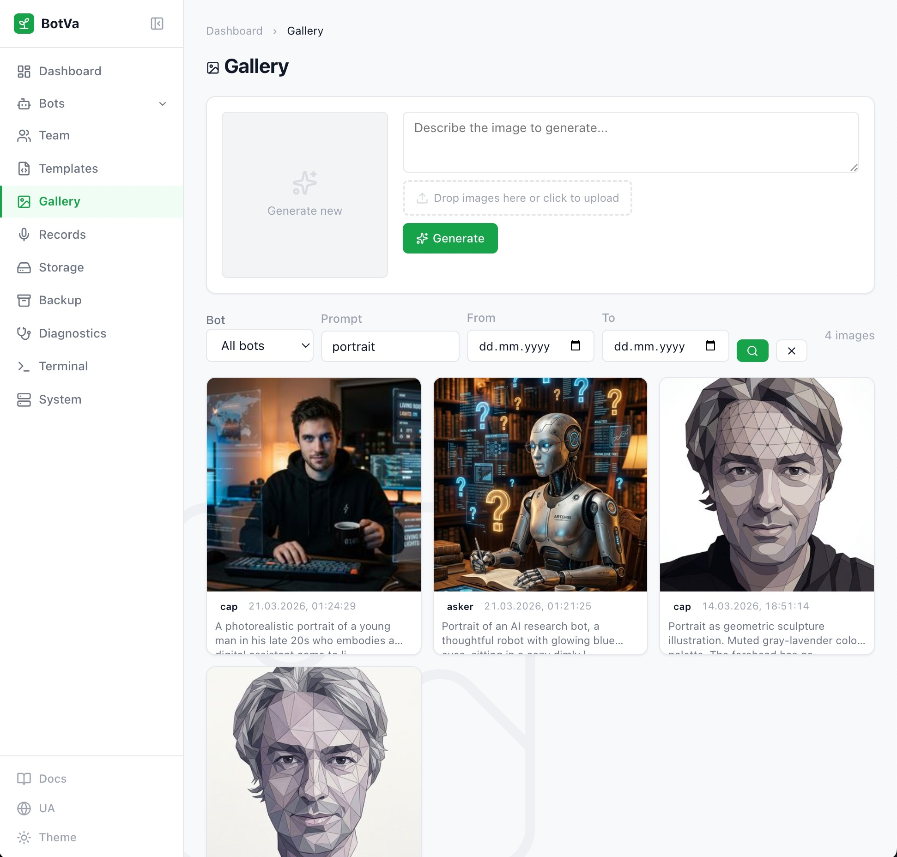

## Records

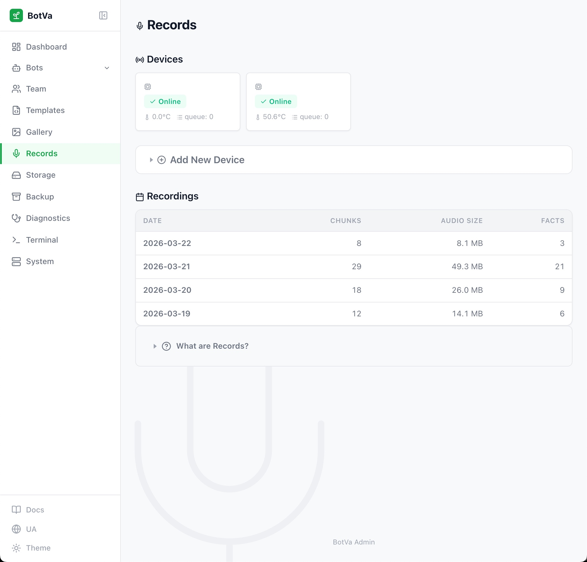

Аудіозаписи з кімнатних пристроїв (Raspberry Pi).

### Вимоги

Потрібен окремий listener-receiver сервіс (`launchd` на macOS). Налаштовується через System → Room Listener.

### Як працює

1. Пристрій записує аудіо і надсилає на сервер.
2. Сервер транскрибує через Groq Whisper.
3. Записи організовані по днях з таймлайном.
4. Клік на запис — повний транскрипт.
5. Можна перетранскрибувати іншою мовою.

## Storage

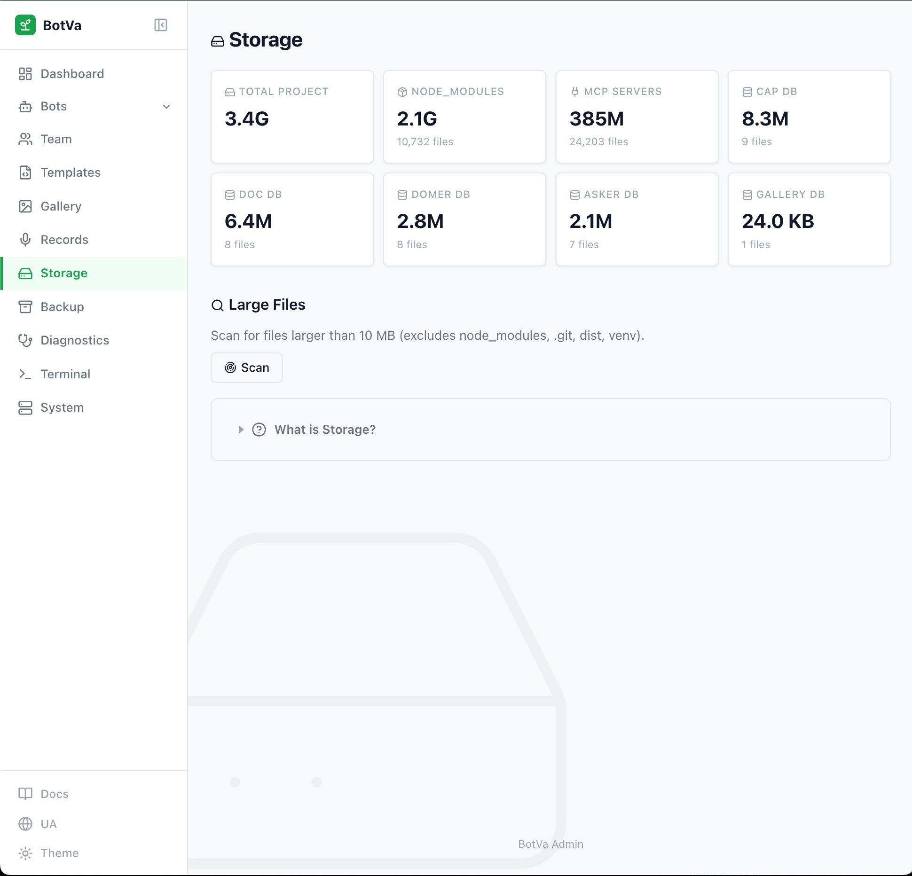

Аналіз використання диску проекту.

### Категорії

- Bot databases — SQLite бази кожного бота
- Gallery — згенеровані зображення
- MCP servers — build-артефакти, venv, node_modules
- Node modules — залежності проекту

### Сканер великих файлів

Знаходить файли > 10 МБ. Можна вибрати та видалити для звільнення місця.

**Безпечно видаляти:** старі логи, кешовані зображення, build-артефакти.
**Небезпечно:** бази даних (`.db`), knowledge файли, `.env`.

## Backup

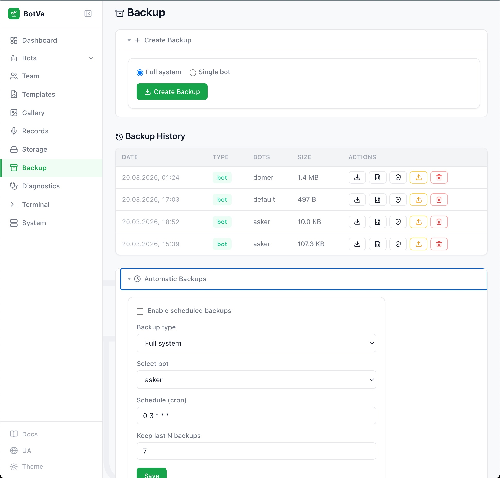

Створення та відновлення бекапів.

### Типи

- **System backup** — все: всі боти, бази, knowledge, налаштування, workspace.
- **Bot backup** — тільки один бот (корисно перед ризикованими змінами).

### Формат

Бекап = `.tar.gz` архів + `manifest.json` з SHA256 контрольними сумами всіх файлів.

### Операції

- **Create** — створити новий бекап (system або конкретного бота).
- **Verify** — перевірити цілісність бекапу по контрольних сумах.
- **Restore** — відновити дані з бекапу. **Увага:** замінює поточні дані!
- **Delete** — видалити файл бекапу.

## Diagnostics

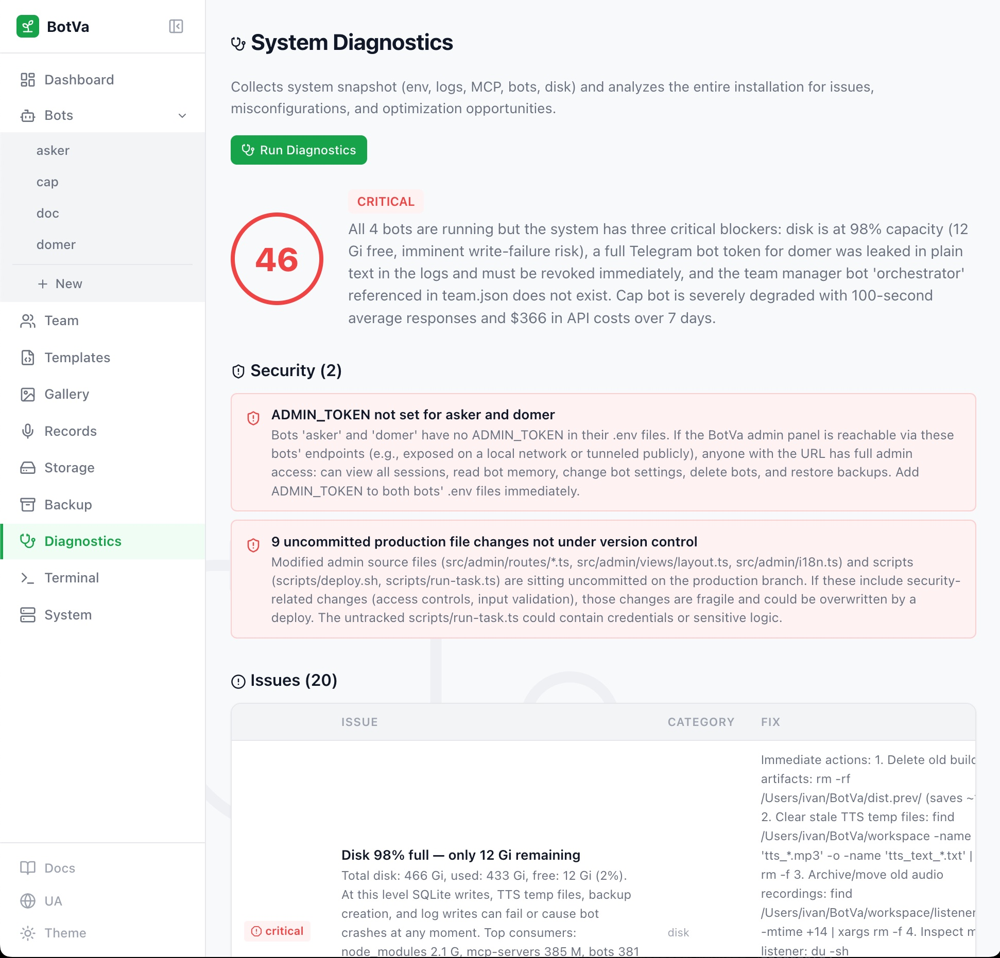

AI-powered діагностика системи.

### Що збирає

- Environment змінні (без значень — тільки які є/яких немає)
- Логи за останню годину
- Статус MCP серверів
- Конфіги ботів
- Використання диску

### Що аналізує

- Здоров'я системи (оцінка 0-100)
- Виявлені проблеми та їх серйозність
- Стан кожного бота
- Стан кожного MCP сервера
- Рекомендації по оптимізації

Аналіз займає 30-60 секунд.

Звіти по ботах та рекомендації:

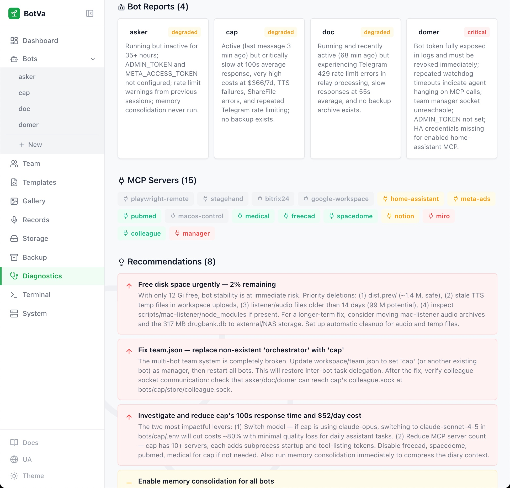

## Terminal

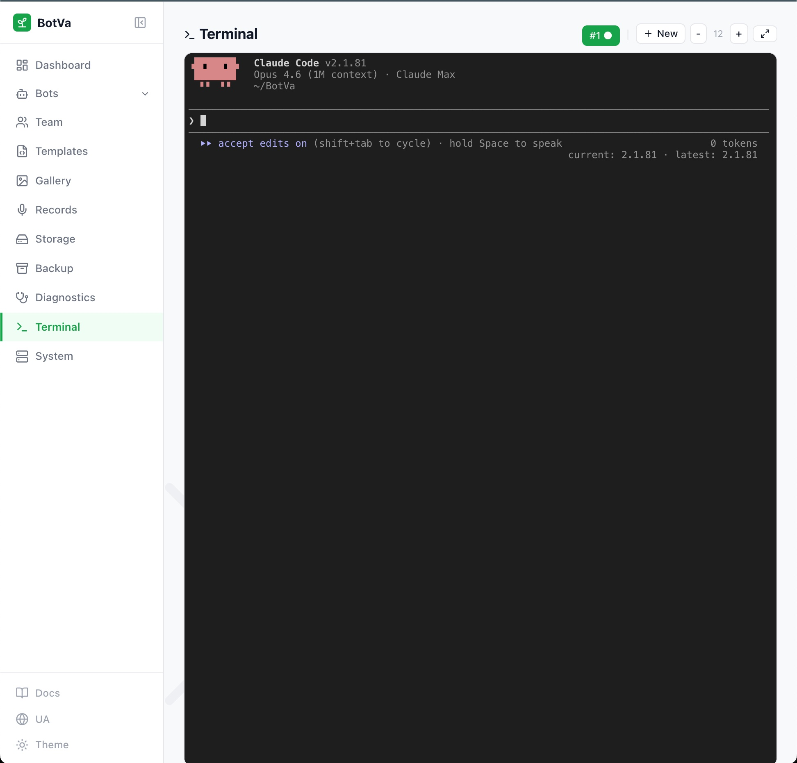

Браузерний shell-термінал сервера (xterm.js).

- Підтримує кілька сесій (вкладки).
- Кнопка `+` відкриває нову сесію.
- Зміна розміру шрифту та fullscreen.
- Сесії зберігаються до закриття.
- Корисний для: `git status`, перегляду логів, запуску скриптів, `npm test`.

## System

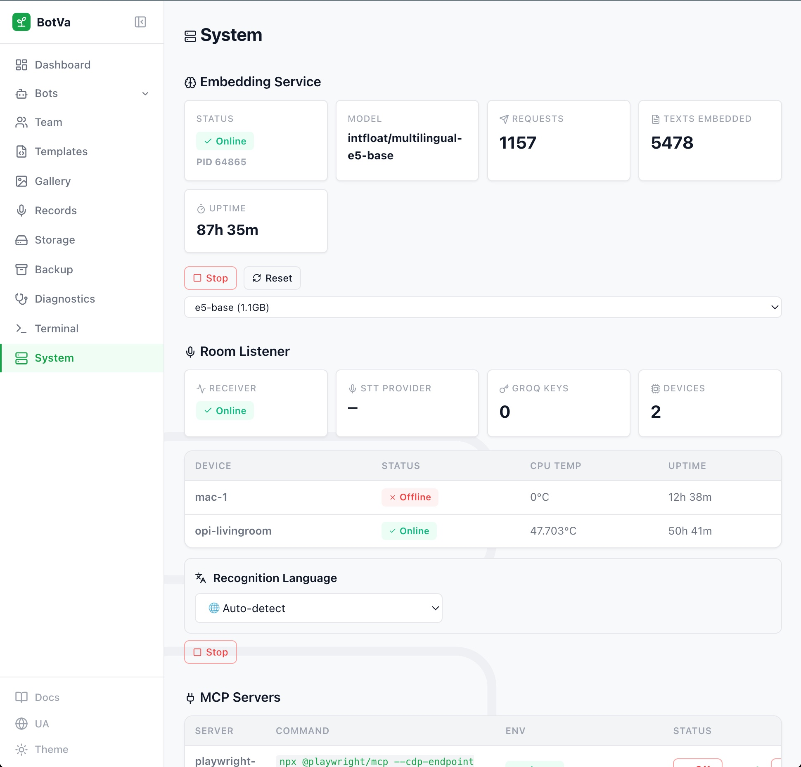

Глобальні перемикачі та конфігурація.

### Embedding Service

Векторний пошук для семантичного пошуку фактів. Використовує multilingual-e5 моделі.

- **Start/Stop** — запуск/зупинка сервісу.
- **Model** — вибір моделі (small 130MB / base 1.1GB / large 2.2GB). Зміна моделі перезапускає сервіс та перевстановлює всі ембеддінги.
- **Reset** — скинути лічильники статистики.

### Room Listener

Управління сервісом прослуховування кімнати (для Records).

- Start/Stop через launchd.
- Вибір мови розпізнавання (auto, uk, en, de тощо).
- Статус підключених пристроїв.

### MCP Servers

Зовнішні інтеграції через Model Context Protocol.

- Enable/Disable — вмикання/вимикання серверів.
- Add/Edit/Delete — управління конфігурацією.
- Env requirements — які env-змінні потрібні (зелений = є, червоний = немає).
- Persistent — сервери що залишаються alive між запитами (браузери).

### Agent Tools

Вбудовані інструменти ботів (62+ штук).

- Enable/Disable — вмикання/вимикання конкретних інструментів.
- System tools (Bash, WebSearch тощо) не можна вимкнути.
- Usage stats — статистика використання за 7 днів, 30 днів, всього.
- Condition — які env-змінні потрібні для доступності.

### Skills

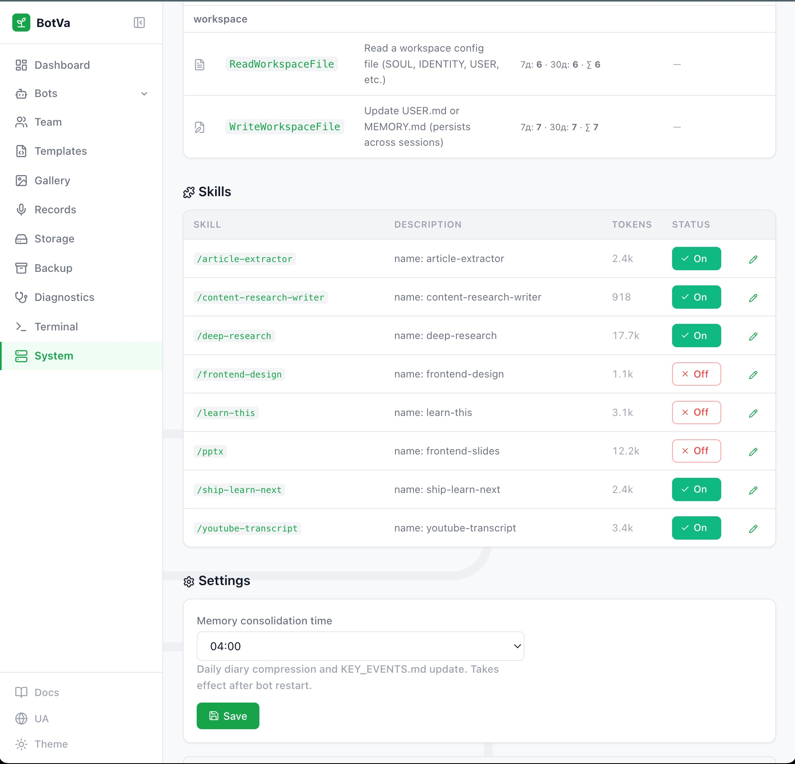

Claude Code скіли, доступні ботам.

- Enable/Disable — перемикання через перейменування SKILL.md ↔ SKILL.md.off.
- Edit — редагування тексту скілу.
- Token estimate — приблизна кількість токенів, яку скіл додає до контексту.

### Settings

- **Consolidation hour** — година щоденної консолідації пам'яті (0, 2, або 4 ранку).

## Конфігурація бота

Кожен бот має свої сторінки в адмінці (доступні через Bots → ім'я бота):

### Config

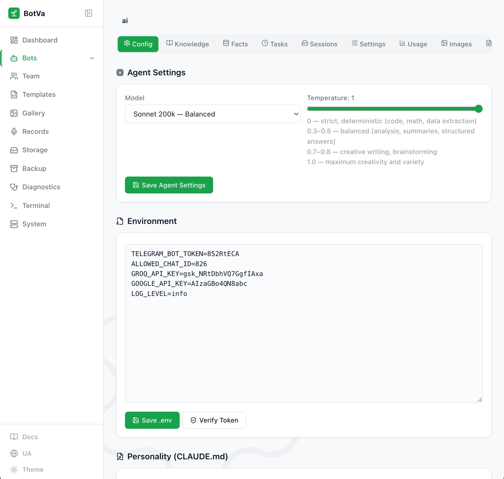

Основні налаштування бота:
- Модель (Opus / Sonnet / Haiku) та температура
- `.env` редактор — всі env-змінні бота
- Workspace files — SOUL.md, IDENTITY.md, ROLE.md, TOOLS.md, USER.md, MEMORY.md

### Knowledge

Файли знань бота (`bots/<name>/knowledge/`):
- Завантаження markdown, txt, json файлів
- Ці файли додаються в контекст агента при кожному запиті

### Facts

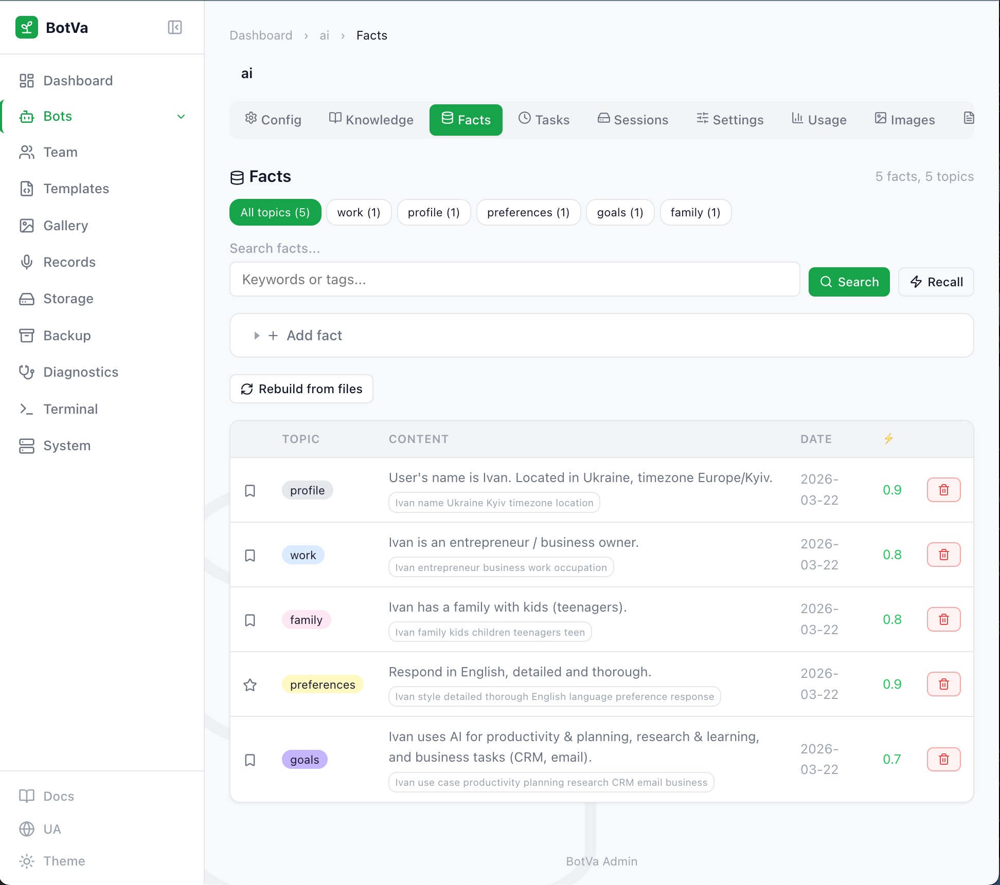

Абсолютна пам'ять бота — факти що ніколи не згасають:
- Перегляд, пошук, редагування, видалення
- Кожен факт має topic, sector (semantic/episodic/preference), importance
- Rebuild — перезбірка з файлів знань

### Tasks

Заплановані cron-задачі:
- Створення, пауза, видалення задач
- Cron-синтаксис (наприклад `0 9 * * *` — щодня о 9:00)
- Результат останнього запуску

### Settings

Налаштування чатів та сесій:
- Active chat sessions
- Saved sessions (перемикання між контекстами)
- Chat toggles (stats footer, auto-react)

### Usage

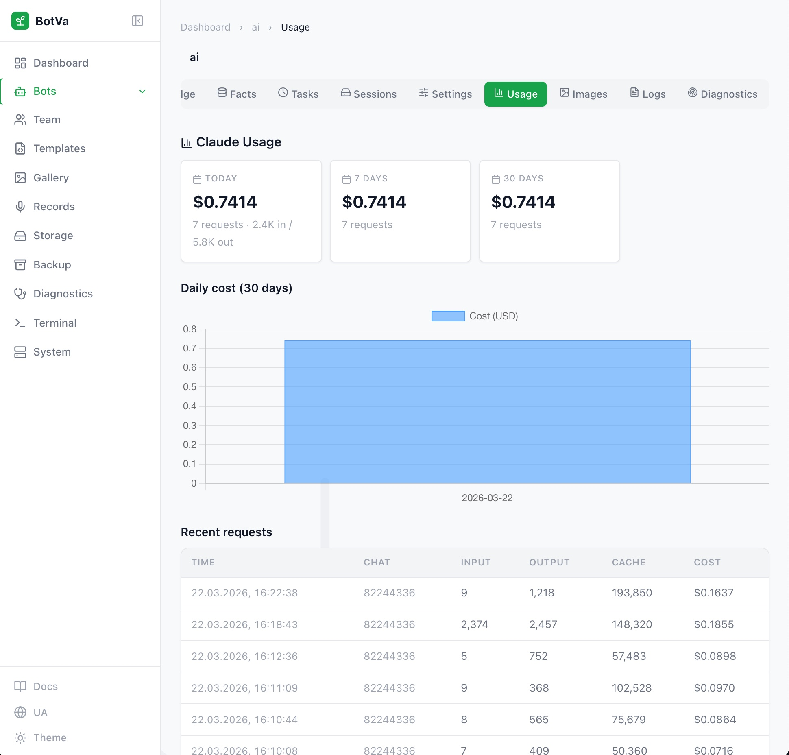

Аналітика використання:
- Токени та витрати по днях
- Input / Output / Cache breakdown
- Графіки за 7, 30, 90 днів

### Images

Галерея зображень конкретного бота.

### Logs

Аудит-лог подій бота + журнал файлів знань.

### Diagnostics (bot)

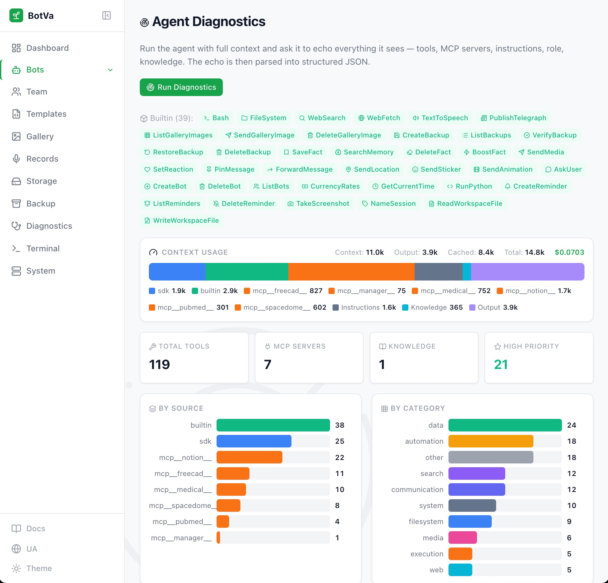

Діагностика конкретного бота:
- Стан env-змінних
- MCP серверів
- Workspace files
- Останні помилки

## Telegram-команди

<p align="center">
  
</p>
<p align="center"><em>Команда /settings — голос, мова, стиль прогресу, agent mode</em></p>

| Команда | Що робить |
|---------|-----------|
| `/start` | Привітання + chat ID |
| `/chatid` | Показати chat ID |
| `/newchat` | Очистити сесію (пам'ять залишається) |
| `/model` | Змінити AI модель |
| `/memory` | Список фактів у пам'яті |
| `/voice` | Увімкнути/вимкнути голосові відповіді |
| `/usage` | Статистика токенів та витрат |
| `/stats` | Увімкнути/вимкнути footer з витратами |
| `/img <prompt>` | Згенерувати зображення |
| `/cancel` | Скасувати поточний запит |
