# BotVa

[](LICENSE)
[](https://nodejs.org)
[](https://www.typescriptlang.org)

[🇬🇧 English](README.en.md)

Мульти-бот Telegram-платформа на базі Claude AI. Один сервер -- багато ботів, кожен зі своєю роллю, пам'яттю, знаннями та інтеграціями.

<p align="center">
  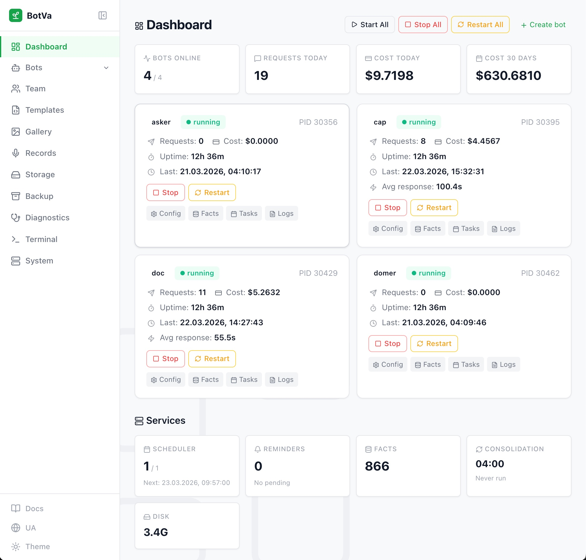
</p>

## Чим BotVa відрізняється

- **Пам'ять як першокласна сутність.** Факти в SQLite (topic, tags, access_count) + щоденні diary-логи розмов + щотижневі консолідації через Claude. Консолідація запускається автоматично щоночі
- **Команда ботів.** Боти спілкуються через Unix-сокети (Colleague MCP), менеджер розподіляє задачі паралельно через `Promise.allSettled()`
- **Повна ізоляція.** Кожен бот -- окремий процес, .env, база, знання, пам'ять, голос, роль. Керуються з однієї адмін-панелі
- **Живе управління.** Веб-панель для створення ботів, галереї зображень, cron-задач, бекапів, діагностики. Модель чату, фонова модель (для сервісних викликів) та reasoning effort змінюються без рестарту, зміни .env потребують рестарту через UI
- **Динамічні інтеграції.** MCP-сервери підключаються за наявності env-змінних -- додав `BITRIX24_WEBHOOK_URL`, перезапустив бота і він отримав CRM. Без зміни коду
- **Філософія.** Базова роль (`_soul.md`) -- маніфест: як думати, як спілкуватись, коли мовчати. Не "certainly!", а людська розмова

## Ключові можливості

<p align="center">
  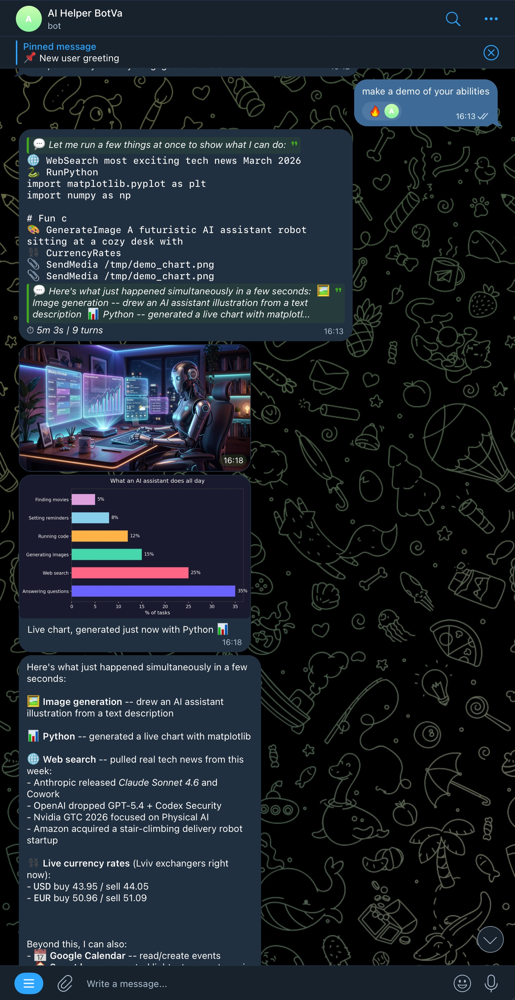
</p>
<p align="center"><em>Паралельне виконання: веб-пошук, генерація зображення, Python-графік, курси валют — одним запитом</em></p>

- **Кілька ботів** з одного інстансу Node.js
- **14 готових ролей** -- від персонального асистента до автономного агента
- **Пам'ять** -- факти з dedup по content-hash, FTS5-пошуком та usefulness-трекінгом, щоденні diary-логи з консолідацією
- **Workspace files** -- 8-шарова збірка CLAUDE.md (SOUL/TOOLS глобальні, BOT_SOUL/BOT_TOOLS/IDENTITY/ROLE/USER/MEMORY per-bot) з feature-flag блоками
- **Голос** -- голосові повідомлення та відповіді (Groq STT + Edge TTS / ElevenLabs з ротацією ключів)
- **Зображення** -- генерація та редагування через Gemini з авто-галереєю
- **Gemini AI** -- друга думка (AskGemini) та пошук з цитатами (GeminiSearch)
- **Команда ботів** -- спілкування через Unix-сокети, делегування задач, каталог агентів-спеціалістів з keyword matcher
- **Планувальник** -- cron-задачі та нагадування з режимом `runAgent` (виконати як повноцінний запит з інструментами)
- **Утиліти** -- курси валют, час, Python sandbox, email, Telegraph
- **Інтеграції** -- Google Workspace, розумний дім, будь-які MCP-сервери
- **Веб-пошук** -- пошук, скрапінг, AI-браузер (Stagehand)
- **Адмін-панель** -- повний веб-інтерфейс для управління
- **Аудіо-рекордер** -- фоновий запис з мікрофона (Orange Pi / Mac), VAD-фільтр тиші, транскрипція Whisper
- **Бекапи** -- повні та per-bot, з SHA256-верифікацією

## Швидкий старт

### Встановлення на VPS (найшвидший спосіб)

Відкрий **https://botva-installer.onrender.com/**, введи IP сервера, Telegram-токен -- і через 3-5 хвилин бот працює. Детальніше: [DEPLOY.md](DEPLOY.md)

### Локальне встановлення

```bash
# 1. Клонувати
git clone https://github.com/cohe4ko/BotVa.git BotVa
cd BotVa

# 2. Встановити залежності та зібрати
./scripts/deploy.sh setup

# 3. Створити першого бота (варіант A: CLI)
npm run new-bot -- my-bot personal-assistant --emoji 🧑‍💼 --name "Мій Бот"

# 3. Створити першого бота (варіант B: веб-інтерфейс)
./scripts/deploy.sh admin  # Запустити адмін-панель
#    Відкрий http://localhost:3000 → Create Bot
#    Токен та chat ID вводяться у формі створення

# 4. Налаштувати токени (якщо CLI)
#    Відкрий bots/my-bot/.env:
#    - TELEGRAM_BOT_TOKEN  (отримати у @BotFather в Telegram)
#    - ALLOWED_CHAT_ID     (надіслати /chatid боту після запуску)

# 5. Залогінитись в Claude CLI
#    Запустити адмін-панель → Термінал (/terminal)
#    та пройти логін через підписку (не API key)

# 6. Запустити
./scripts/deploy.sh start
```

Після запуску напиши боту в Telegram -- він відповість.

<details>
<summary>Створення бота через веб-інтерфейс</summary>

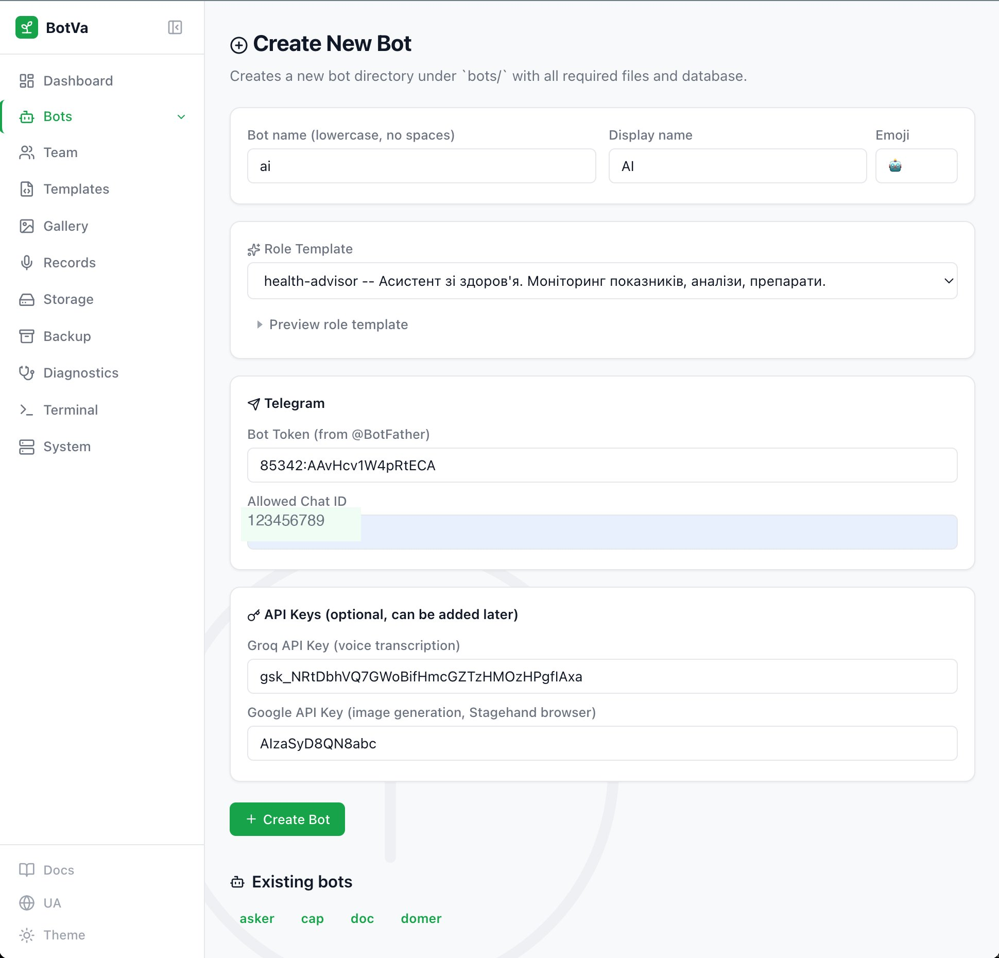

Обери роль, введи Telegram-токен від @BotFather та chat ID. API-ключі можна додати пізніше.

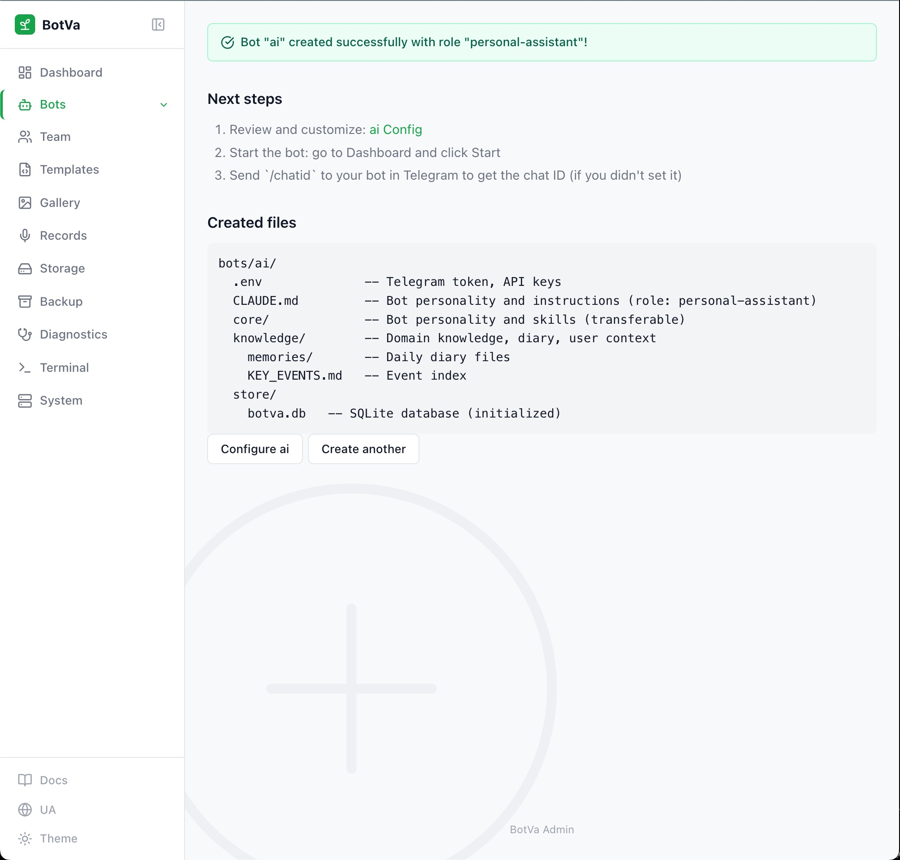

Після створення — структура файлів та наступні кроки.
</details>

## Ролі ботів

При створенні бота обираєш роль -- вона визначає спеціалізацію, інструменти та стиль.

| Роль | Slug | Опис |
|------|------|------|
| Персональний асистент | `personal-assistant` | Повсякденні задачі, розклад, CRM, розумний дім |
| Дослідник | `researcher` | Глибокий аналіз, верифікація фактів, звіти |
| Здоров'я | `health-advisor` | Моніторинг показників, аналізи, рекомендації |
| Академічний | `academic` | Наукові статті, методологія, PhD, викладання |
| Креативний | `creative` | Дизайн, зображення, презентації, копірайтинг |
| Продажі | `sales` | Ліди, угоди, аналіз продажів, пропозиції |
| Планувальник | `planner` | Задачі, дедлайни, пріоритизація |
| База знань | `knowledge-base` | Документація, FAQ, пошук знань |
| Менеджер | `manager` | Координація команди ботів, делегування |
| Продукт/Ринок | `product-market` | CRM-аналітика, позиціонування, конкуренти |
| Вебмайстер | `webmaster` | Сайт, контент, деплой, SEO |
| Дебати та дослідження | `debate-researcher` | Аналіз з протилежних позицій |
| Автономний агент | `autonomous` | Довготривалі задачі без участі користувача, власний `_soul_autonomous.md` |
| Dome Engineer | `dome-engineer` | Інженерні задачі, діагностика, оркестрація технічних workflow |

```bash
npm run new-bot -- <slug> <роль> [--emoji 🤖] [--name "Назва"]
```

## Можливості

### Telegram

Перша взаємодія з ботом — привітання, налаштування профілю, нагадування та пошук з уточнюючими питаннями:

<p align="center">
  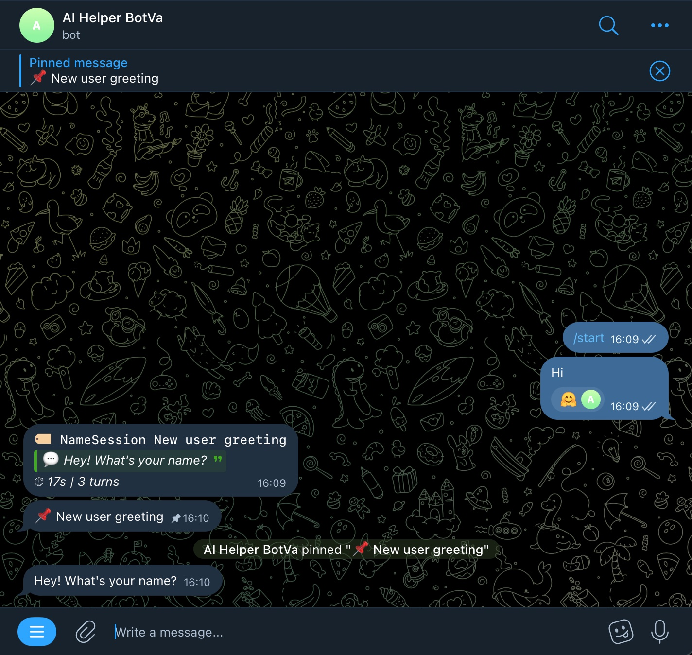
  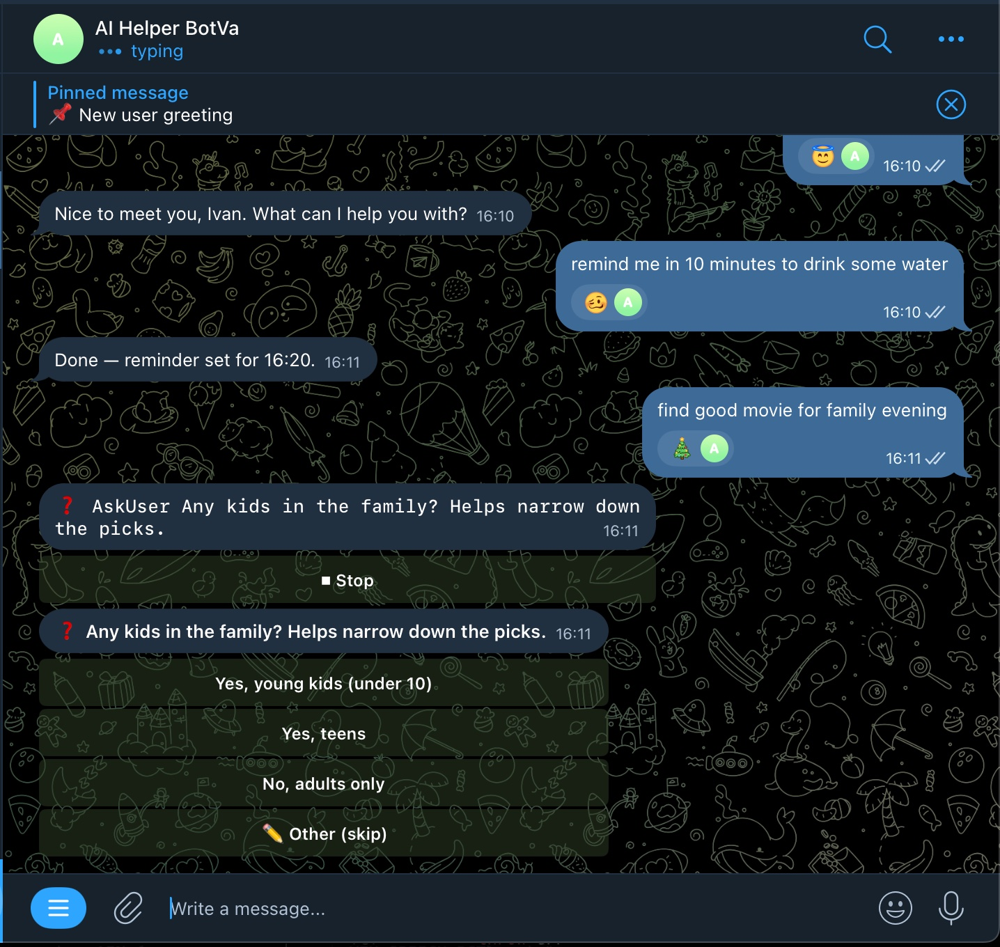
</p>

### Голос

Бот розуміє голосові повідомлення та може відповідати голосом. STT через Groq Whisper (потрібен `GROQ_API_KEY`). Інструмент `TranscribeAudio` дає боту самостійно транскрибувати локальні файли — якщо файл понад 24 MB або в неприйнятному форматі, ffmpeg автоматично перекодовує в 16 kHz mono FLAC і ріже на 25-хвилинні чанки, транскрипти склеюються. Два TTS-провайдери: Edge-TTS (безкоштовно, дефолт) та ElevenLabs (вища якість, локальний JSON-стор ключів з ручною ротацією, відстеженням ліміту/помилок, fallback на Edge при вичерпанні квоти). Провайдери конфігуруються окремо для автовідповідей (`TTS_PROVIDER_REPLY`) та tool-синтезу (`TTS_PROVIDER_TOOL`). Sentence-aware чанкування довгих текстів (до 20 фрагментів) з надсиланням послідовних voice-повідомлень. Голоси, швидкість, stability/similarity — через вкладку `/audio` в адмінці. Команда `/voice` вмикає/вимикає голосові відповіді, `/usage` показує статус ключів ElevenLabs.

### Зображення

Генерація та редагування через Gemini (`GOOGLE_API_KEY`). Команда `/img опис` або просто попроси в чаті. Всі зображення зберігаються в галереї.

### Пам'ять

Трирівнева система: факти (постійне сховище з topic та tags), щоденні markdown-логи, workspace-файли (USER.md, MEMORY.md). Консолідація о `NIGHT_OWL_HOUR`.

<p align="center">
  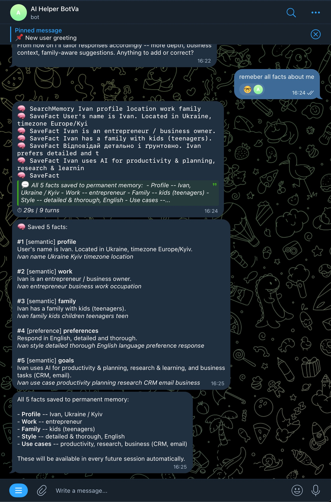
  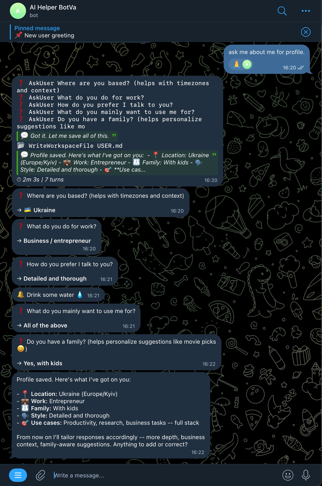
</p>
<p align="center"><em>Ліворуч: збереження фактів через SaveFact/SearchMemory. Праворуч: заповнення профілю через AskUser</em></p>

### Планувальник

Cron-задачі: `/schedule 0 9 * * * Що в мене на сьогодні?`. Стандартний 5-полевий cron.

### Команда ботів

Менеджер координує роботу, боти спілкуються через Colleague MCP (Unix-сокети). Кожен бот може звернутись до менеджера через `ask_manager()`.

### Telegram

SendMedia (фото, документи, альбоми), ForwardMessage, SetReaction, PinMessage, OpenWebApp (Mini App), AskUser (кнопки, poll).

### Утиліти

CurrencyRates (готівкові курси), GetCurrentTime, RunPython (sandbox), SendEmail (SMTP), PublishTelegraph.

### Workspace Files

Бот читає та оновлює свої файли між сесіями: USER.md (профіль), MEMORY.md (пам'ять) через ReadWorkspaceFile / WriteWorkspaceFile.

Детальний посібник: [MANUAL.md](MANUAL.md)

## Інтеграції

Будь-який [MCP-сервер](https://modelcontextprotocol.io) можна підключити через `mcp-servers.json`.

**Вбудовані (в комплекті):**

| Інтеграція | MCP-сервер | Потрібні змінні |
|------------|-----------|-----------------|
| Playwright (headless Chrome) | `playwright-remote` | -- |
| Stagehand (AI-браузер) | `stagehand` | `GOOGLE_API_KEY` |
| Google Calendar, Gmail, Drive | `google-workspace` | `GOOGLE_OAUTH_CLIENT_ID`, `GOOGLE_OAUTH_CLIENT_SECRET` |
| Home Assistant | `home-assistant` | `HA_URL`, `HA_TOKEN` |

Інші MCP-сервери (CRM, реклама, наукові бази тощо) додаються як запис в `mcp-servers.json` та увімкнюються в адмінці System → MCP Servers.

## Аудіо-рекордер (Listener)

Система фонового запису аудіо з мікрофонів, автоматична транскрипція (Groq Whisper) та аналіз через Claude.

**Компоненти:**

| Компонент | Опис | Розташування |
|-----------|------|-------------|
| Receiver | HTTP-сервер, приймає WAV, транскрибує, аналізує | `scripts/orange-pi-listener/receive-transcript.ts` |
| Orange Pi Listener | Python-демон для SBC з мікрофоном | `scripts/orange-pi-listener/listener.py` |
| Mac Listener | Electron tray app для macOS | `scripts/mac-listener/` |

**Як працює:**

1. Пристрій записує аудіо чанками (за замовчуванням 5 хв)
2. VAD (Voice Activity Detection) фільтрує тишу — чанки з < 15% мовлення пропускаються
3. Чанки з голосом відправляються на Receiver (`POST /audio`, multipart WAV)
4. Receiver транскрибує через Groq Whisper та зберігає щоденні конспекти

**Mac Listener (tray app):**

```bash
cd scripts/mac-listener && npm install && npm start
```

Env: `UPLOAD_URL=http://host:3847/audio`, `DEVICE_ID=mac-1`. Два режими: Toggle (ручний старт/стоп) та Continuous (автоматичні чанки). Вимагає `ffmpeg`.

**Receiver:**

```bash
npx tsx scripts/orange-pi-listener/receive-transcript.ts
```

Env: `GROQ_API_KEY` (або `GROQ_API_KEYS`), `LISTENER_PORT=3847`, `ANTHROPIC_API_KEY` (для аналізу).

Пристрої відображаються в адмін-панелі System → Recorder.

## Адмін-панель

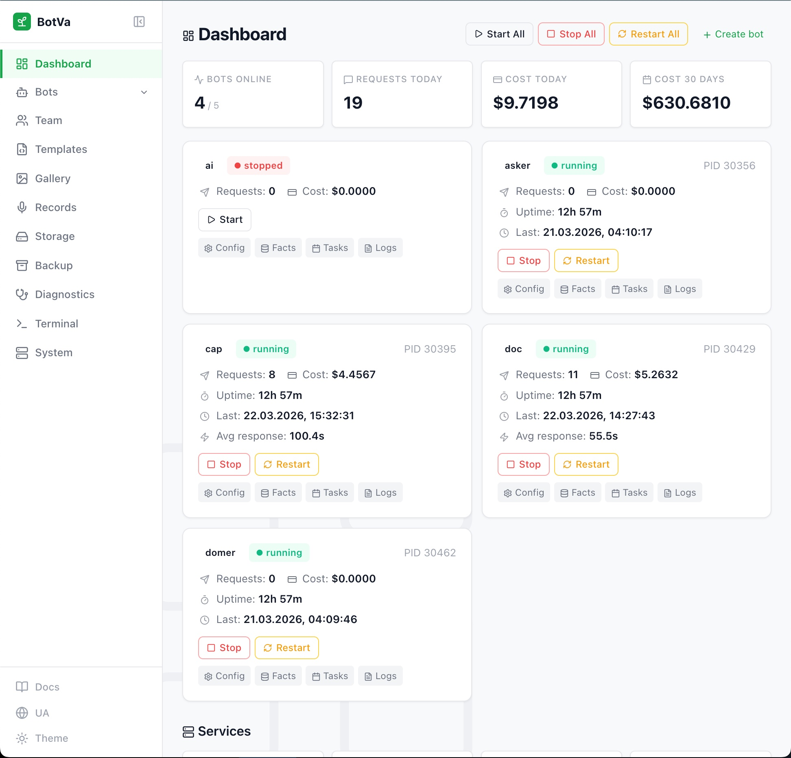

Веб-інтерфейс для управління ботами. Два способи запуску:

```bash
# 1. З Telegram (on-demand, автостоп через 20 хв)
/admin

# 2. Як окремий сервіс (постійний)
./scripts/deploy.sh admin
```

| Розділ | Що робить |
|--------|-----------|
| Dashboard | Статус ботів, запити, витрати, сервіси |
| Config | Модель чату, фонова модель, reasoning effort, env-змінні, workspace files (8 шарів) |
| Knowledge | Файли знань бота |
| Facts | Пам'ять: перегляд, пошук, редагування, FTS5-пошук |
| Tasks | Нагадування та cron-задачі з повним редагуванням (текст, розклад, runAgent) |
| Settings | Налаштування чатів, сесії |
| Usage | Аналітика токенів та витрат |
| Audio | TTS-провайдери (Edge / ElevenLabs), вибір голосів, параметри швидкості/якості, ключі ElevenLabs з лічильниками |
| System | Builtin tools, MCP servers, skills on/off |
| Images | Галерея згенерованих зображень |
| Logs | Аудит подій |
| Diagnostics | AI-діагностика системи |
| Backup | Створення та відновлення бекапів |
| Team | Управління командою ботів |
| Templates | Шаблони ролей |
| Terminal | Браузерний shell |
| Create Bot | Майстер створення нового бота |

Детальний посібник: [MANUAL.md](MANUAL.md)

## Telegram-команди

<p align="center">
  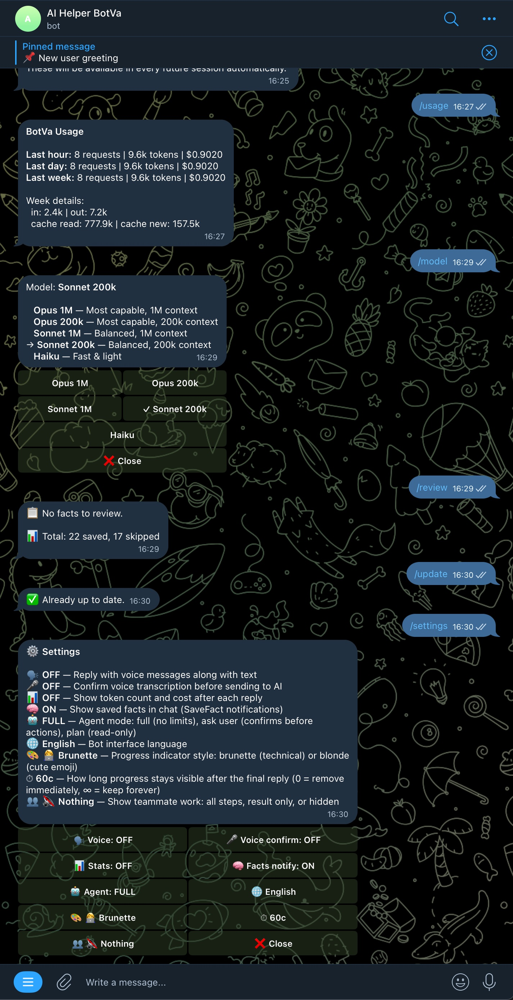
  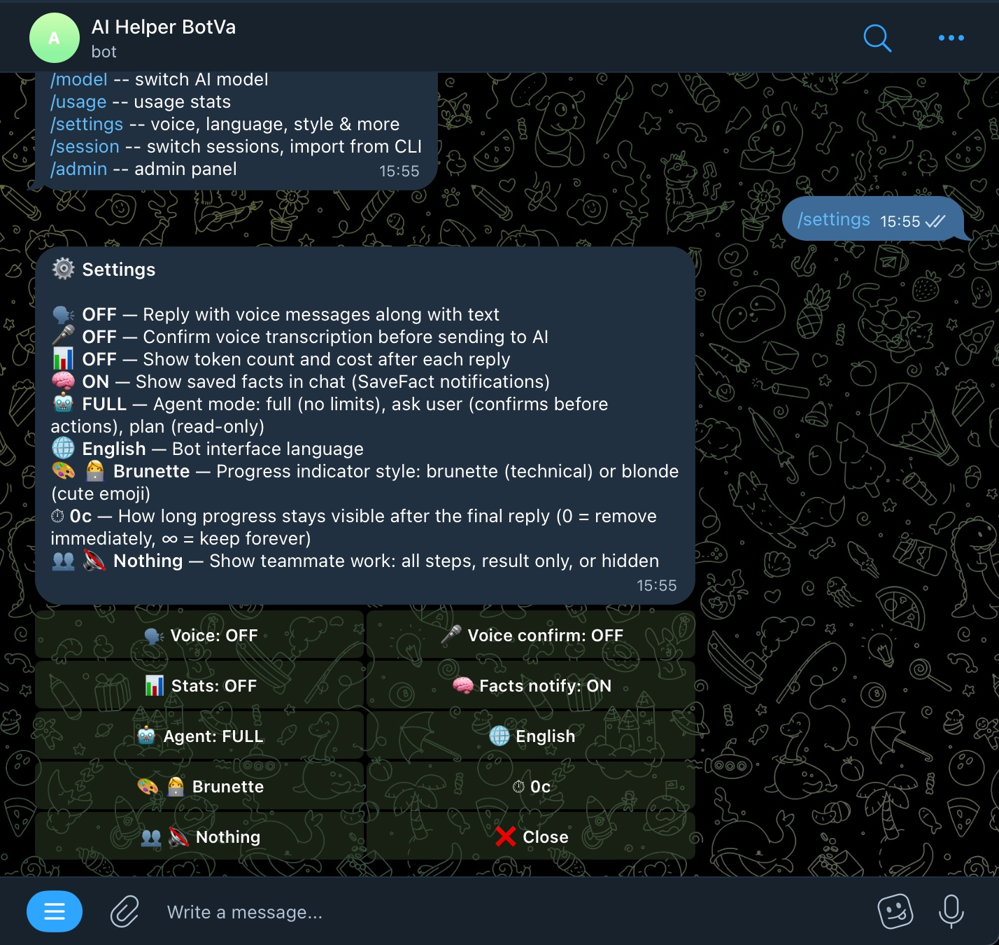
</p>
<p align="center"><em>Команди /usage, /model, /facts, /settings — управління ботом з Telegram</em></p>

| Команда | Опис |
|---------|------|
| `/start` | Привітання та chat ID |
| `/chatid` | Показати chat ID |
| `/newchat`, `/forget` | Очистити сесію (пам'ять залишається) |
| `/voice` | Увімкнути/вимкнути голосові відповіді |
| `/img <опис>` | Згенерувати зображення |
| `/model` | Перемкнути модель чату та reasoning effort |
| `/schedule <cron> <текст>` | Створити задачу |
| `/usage` | Статистика токенів, статус Claude-логіну, ліміти підписки та ключі ElevenLabs |
| `/stats` | Inline-статистика on/off |
| `/lang` | Мова інтерфейсу |
| `/admin` | Адмін-панель |
| `/session` | Перегляд CLI-сесій |
| `/cancel` | Скасувати запит |

## Структура проекту

```
BotVa/
├── src/                    # Код платформи (TypeScript)
│   ├── index.ts            # Точка входу
│   ├── bot.ts              # Telegram бот
│   ├── agent.ts            # Claude agent з MCP
│   ├── builtin-tools.ts    # Вбудовані інструменти
│   ├── memory.ts           # Система пам'яті
│   ├── db.ts               # SQLite
│   ├── voice.ts            # STT/TTS
│   ├── imagen.ts           # Генерація зображень
│   ├── scheduler.ts        # Планувальник
│   └── admin/              # Веб адмін-панель
├── roles/                  # Шаблони ролей
│   ├── _soul.md            # Базовий характер (для всіх ботів)
│   ├── _tools.md           # Базовий routing інструментів
│   └── *.md                # Ролі (personal-assistant, researcher, ...)
├── mcp-servers/            # MCP сервери
│   ├── colleague/          # Міжботова комунікація
│   └── manager/            # Координація менеджером
├── scripts/                # Скрипти управління
├── installer/              # Веб-інсталятор
├── bots/                   # Дані ботів (gitignored)
├── workspace/              # Runtime дані (gitignored)
├── .env.example            # Шаблон конфігурації
└── package.json
```

## Управління

```bash
./scripts/deploy.sh setup      # Встановити залежності, зібрати
./scripts/deploy.sh start      # Запустити всі боти
./scripts/deploy.sh stop       # Зупинити
./scripts/deploy.sh restart    # Перезапустити
./scripts/deploy.sh build      # Перезібрати TypeScript + MCP
./scripts/deploy.sh status     # Статус
./scripts/deploy.sh backup     # Бекап
./scripts/deploy.sh restore    # Відновлення
```

## Деплой

Детальний гайд з конфігурацією та всіма варіантами: [DEPLOY.md](DEPLOY.md)

## Технічний стек

- **Runtime**: Node.js 20+, TypeScript (strict)
- **Telegram**: Grammy
- **AI**: Anthropic Claude Agent SDK
- **Database**: SQLite (вбудований в Node.js)
- **Web**: Hono
- **Voice**: Edge-TTS / ElevenLabs (синтез), Groq Whisper (розпізнавання)
- **Images**: Google Gemini
- **Browser**: Stagehand / Playwright
- **Тести**: Vitest 4.x

## Як долучитись

Дивись [CONTRIBUTING.md](CONTRIBUTING.md).

## FAQ

**Як дізнатись свій chat ID?**
Запусти бота та надішли `/start` або `/chatid`.

**Як додати знання боту?**
Поклади .md або .txt файли в `bots/<name>/knowledge/`. Також через адмін-панель (Knowledge).

**Як підключити інтеграцію?**
Додай відповідні змінні в `.env` бота. Після перезапуску бот автоматично отримає інструменти.

**Як переїхати на інший сервер?**
Дивись розділ "Міграція" в [DEPLOY.md](DEPLOY.md).

## Ліцензія

MIT
